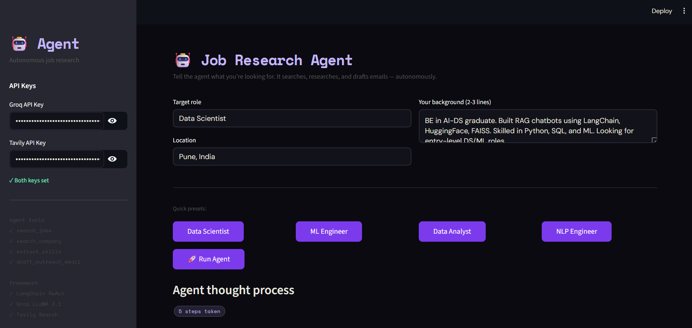

# 🤖 Job Research Agent



An autonomous AI agent that researches job opportunities, analyzes required skills, and drafts personalized outreach emails — all in one go.

Built with **LangChain ReAct · Groq LLaMA 3.1 · Tavily Search · Streamlit**

---

## What makes this an "agent" (not just a chatbot)

A chatbot answers one question at a time. An agent:
- Receives a **goal**, not just a question
- **Decides on its own** which tools to call and in what order
- **Reflects** on results and plans next steps
- **Loops** until the goal is complete

```
User gives goal
      ↓
Agent thinks → picks tool → calls tool → gets result
      ↓
Agent reflects → done? or pick next tool?
      ↓ (loops)
Final answer delivered
```

---

## Agent tools

| Tool | What it does |
|---|---|
| `search_jobs` | Searches web for job listings matching role + location |
| `search_company` | Researches specific companies found in listings |
| `extract_skills` | Analyzes job descriptions for in-demand skills |
| `draft_outreach_email` | Writes personalized cold emails |

---

## Quick Start

```bash
git clone https://github.com/YOUR_USERNAME/job-research-agent.git
cd job-research-agent

python -m venv venv
venv\Scripts\activate        # Windows
source venv/bin/activate     # Mac/Linux

pip install -r requirements.txt
streamlit run app.py
```

**API keys needed (both free):**
- Groq: https://console.groq.com
- Tavily: https://tavily.com

---

## Project structure

```
job-research-agent/
├── app.py          # Streamlit UI
├── agent.py        # ReAct agent — brain + executor
├── tools.py        # 4 custom tools the agent can call
├── requirements.txt
└── README.md
```
